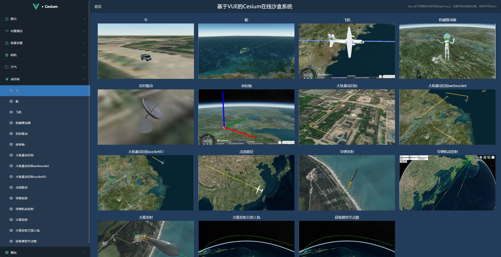
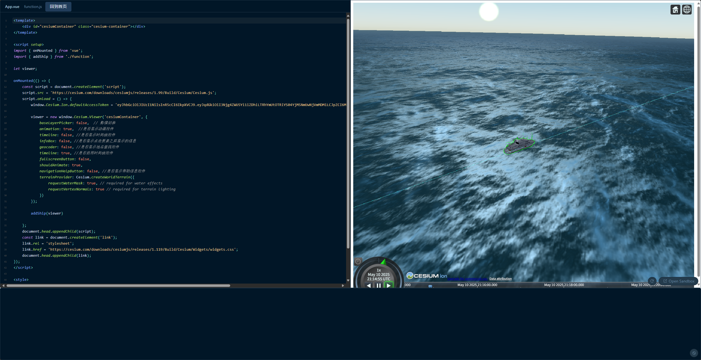

# README

基于`Vue3`和`sandpack`搭建的在线`Cersium`项目，是纯前端项目，案例的代码是通过静态文件保存的。

可以在线的观看具体的效果实现，在在线的代码编译器上实现代码的修改和调试，可以实时的观察调试后的效果。

首页界面如下所示：

点击具体的案例，进入改案例的在线代码编辑器界面，左侧是代码展现和编辑区域，右侧是实时编译的效果呈现区域，底部是控制台，可以打印输出，供调试使用：

项目中使用到的静态资源（二维图片和三维模型）存放在以下的仓库中，是加载资源仓库获取资源的：

- [JinLinC0/Cesium-assets: Cesium图片和3D资源仓库](https://github.com/JinLinC0/Cesium-assets)
- [Cesium-assets: Cesium图片和3D资源仓库](https://gitee.com/JinLinC/cesium-assets)
